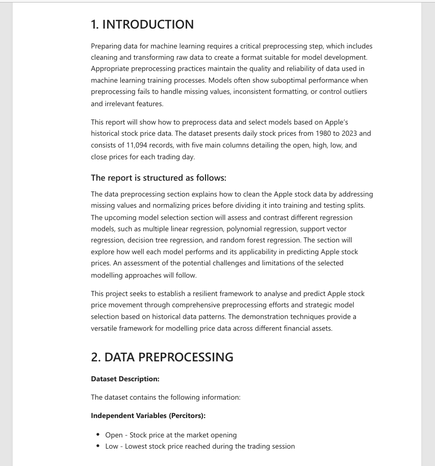
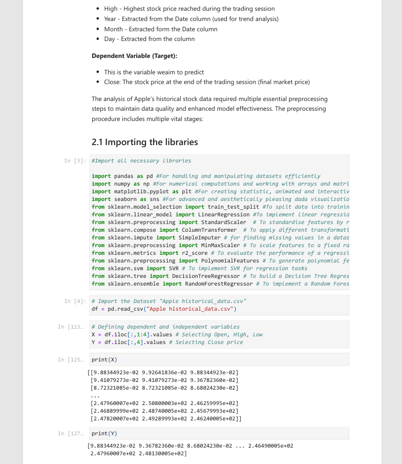
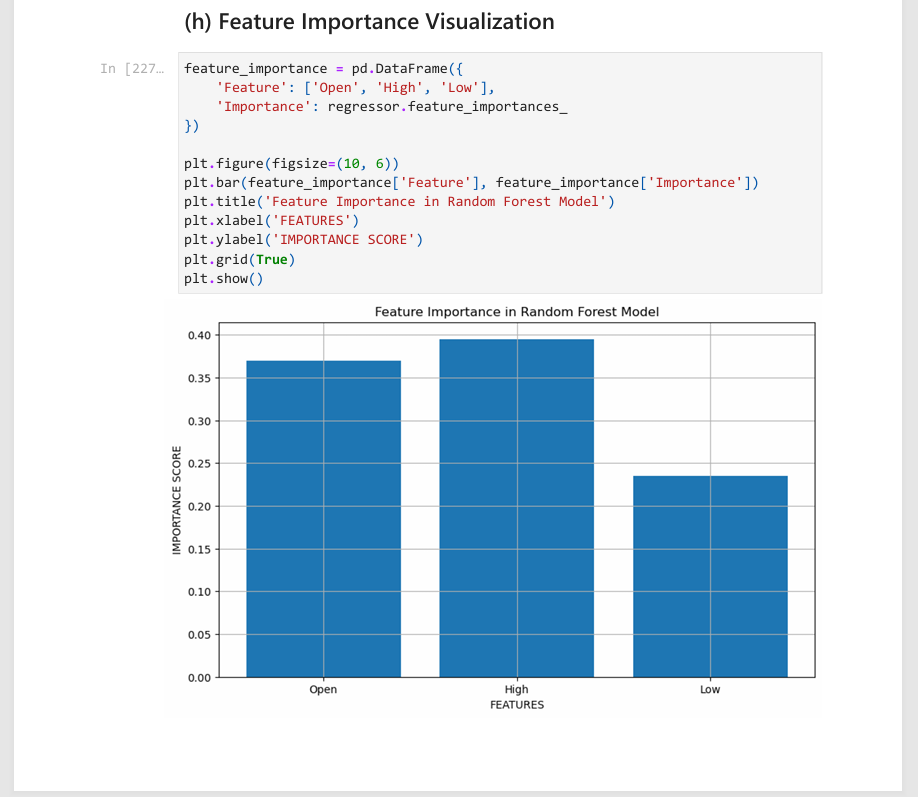
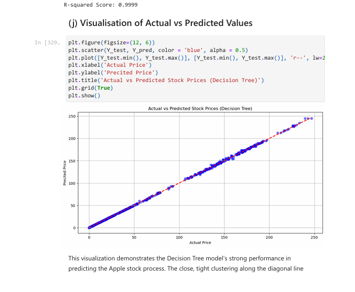
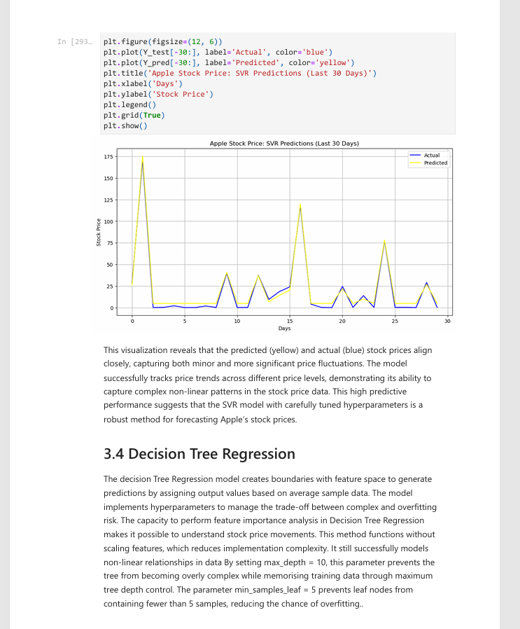
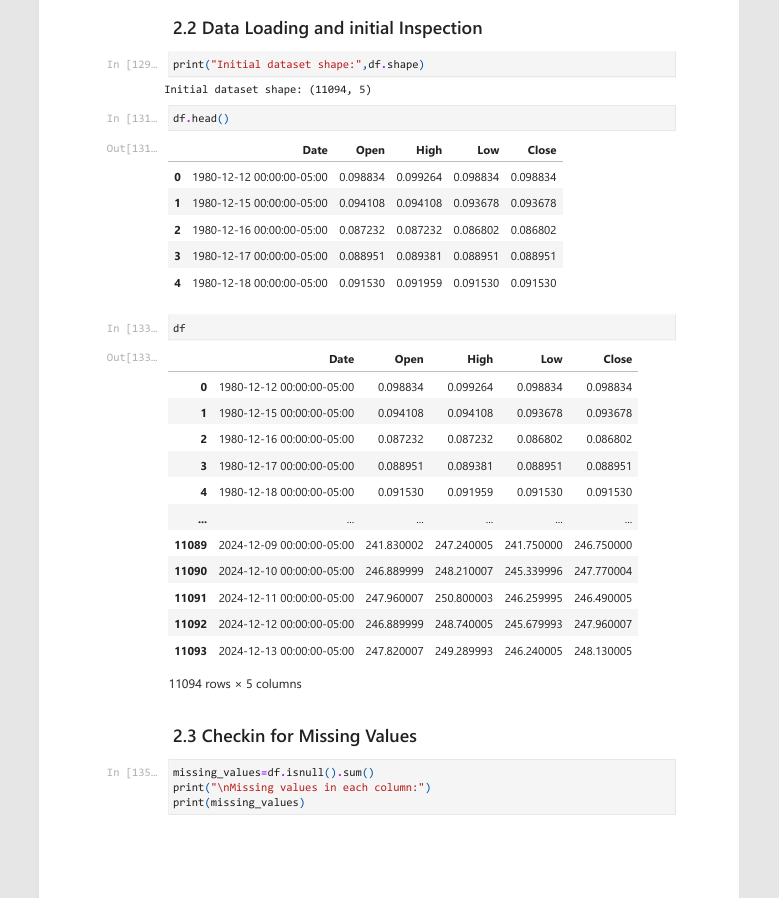
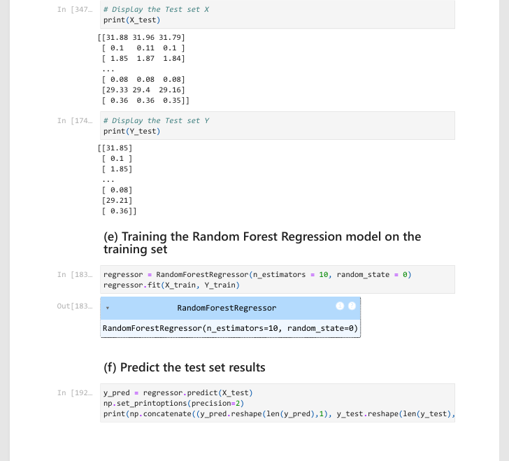
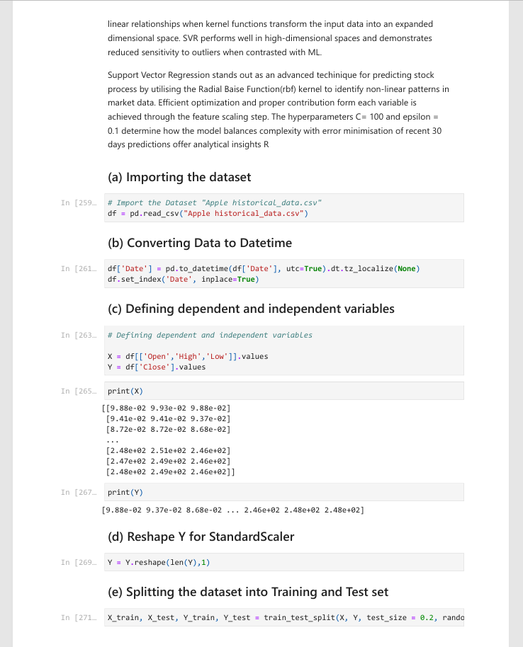
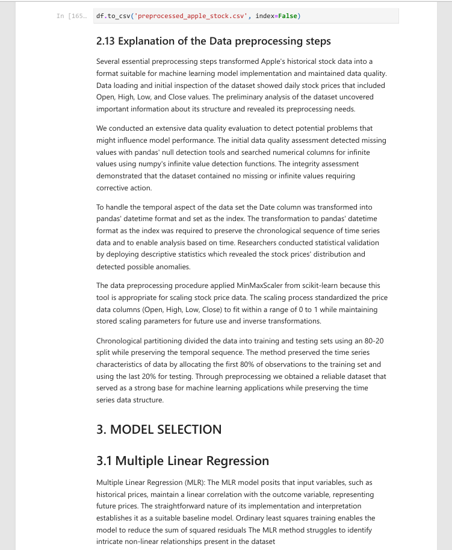
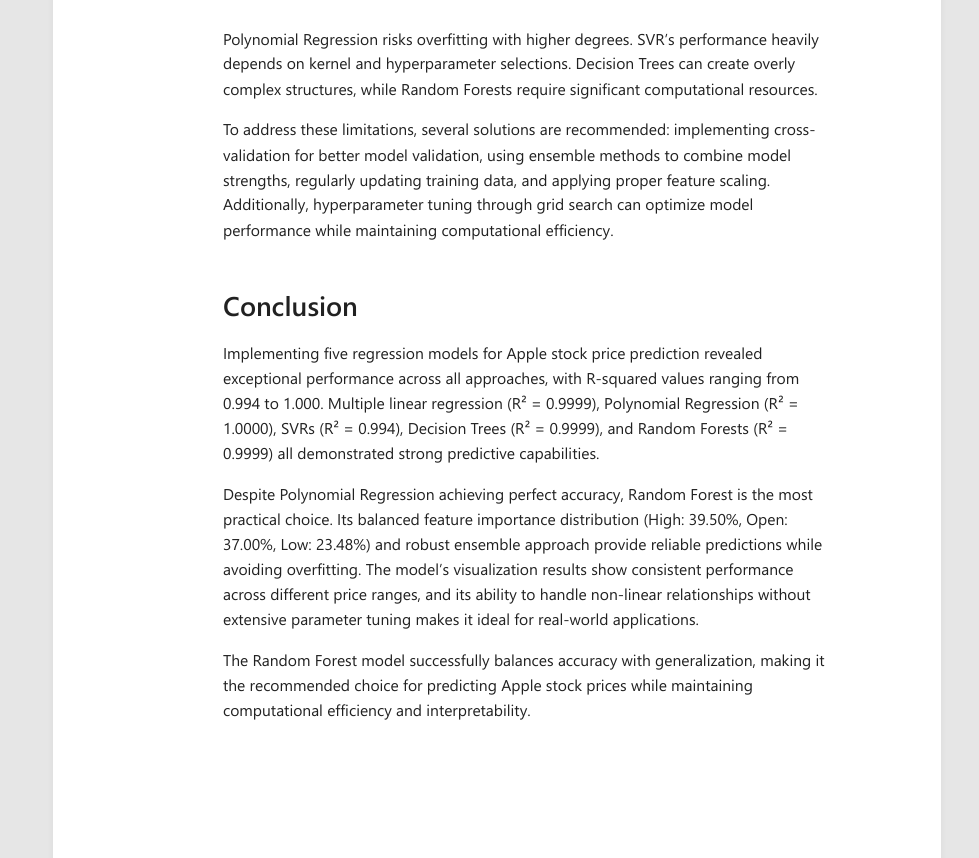

# Apple-Stock-Price-Prediction-Supervised-Regression


This project applies five supervised regression models (Linear Regression, Ridge, Lasso, ElasticNet, and Random Forest) to forecast Apple's historical stock prices using daily data from 1980 to 2023.

---

## 💾 Installation

To set up the project locally:

```bash
git clone https://github.com/eahemor/Supervised-Learning-Apple-s-Historical-Stock-Price-Data.git
cd Supervised-Learning-Apple-s-Historical-Stock-Price-Data
pip install -r requirements.txt
```

---

## 📊 Dataset

- Source: `pd.read_csv("Apple historical_data.csv")`
- Features: `Open`, `High`, `Low`
- Target: `Close`

---

## 🔧 Preprocessing Steps

- Checked for missing values and outliers
- Scaled data using `MinMaxScaler`
- Split into 80% training, 20% test

---

## 📊 Visualizations and Outputs

### 📌 Introduction


### 📚 Libraries Used


### 📈 Data Visualizations





### 🧠 Model Training & Evaluation





### 📌 Conclusion


---

## 🧠 Models Used

- Linear Regression
- Ridge Regression
- Lasso Regression
- ElasticNet Regression
- Random Forest Regressor

---

## 🧮 Evaluation Metrics

- Mean Squared Error (MSE)
- Root Mean Squared Error (RMSE)
- R² Score

---

## 📁 Project Structure

```text
📦Supervised-Learning-Apple-s-Historical-Stock-Price-Data
 ┣ 📂screenshots/                # Markdown report visuals (text, code blocks, outputs)
 ┣ 📜requirements.txt            # Dependencies
 ┣ 📜README.md                   # Project overview
 ┣ 📜LICENSE                     # MIT License
 ┗ 📜.gitignore
```

---

## 📝 Conclusion

Random Forest provided the best balance between performance and generalisation. SVR showed solid results on recent price fluctuations. All models scored high R² values.

---

**MSc Data Science Project**

**Ebenezer Ahemor**
